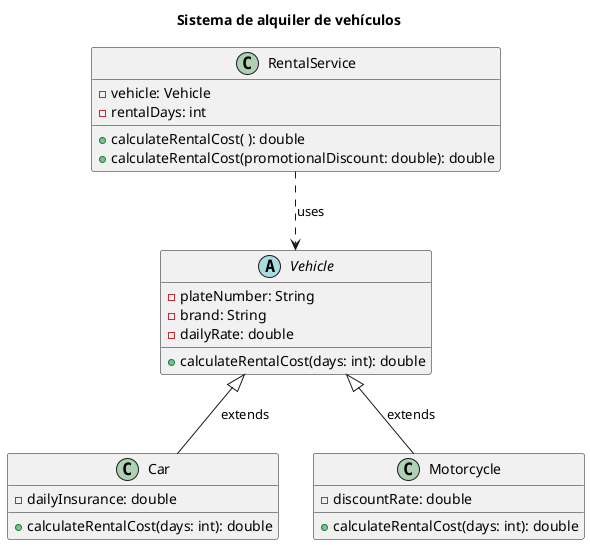

# **Caso de estudio: sistema de alquiler de vehículos**

Una empresa de alquiler de automóviles y motocicletas desea implementar un sistema para gestionar la información de cada unidad y calcular el costo del alquiler según el tipo de vehículo y la duración del alquiler. El sistema debe permitir registrar los vehículos disponibles, sus características, y calcular el costo total del alquiler basado en la tarifa diaria y el número de días que se desea alquilar.

Todos los vehículos tienen un número de placa, una marca y una tarifa diaria de alquiler. El costo base de un alquiler se obtiene multiplicando la tarifa diaria por el número de días de alquiler.

Sin embargo, el importe final depende del tipo de vehículo:
- **Automóviles**: se debe agregar un seguro por cada día de alquiler.
- **Motocicletas**: se debe aplicar un porcentaje de descuento sobre el costo base del alquiler.

Además, la empresa puede aplicar opcionalmente un descuento promocional sobre el importe previamente calculado.

